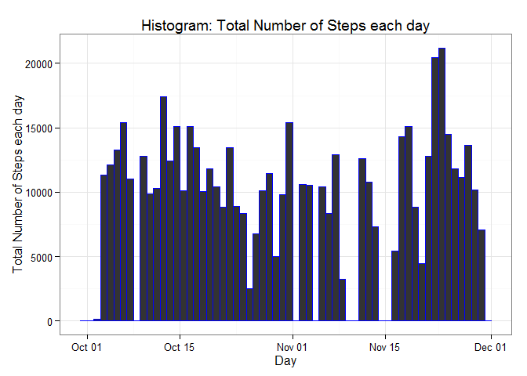
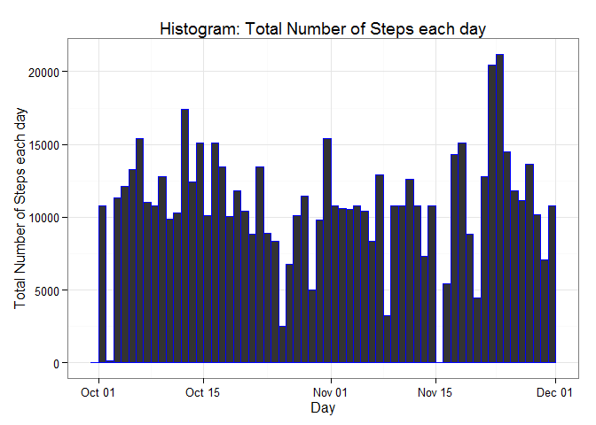
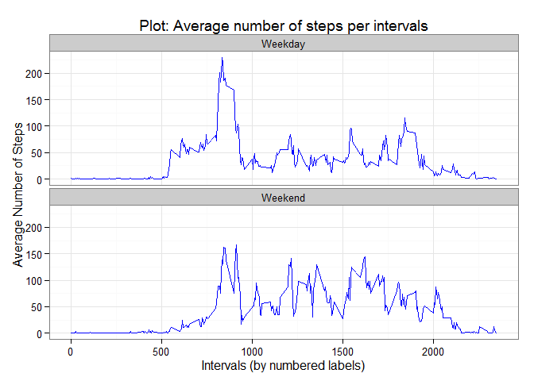

# Reproducible Research: Peer Assessment 1

**By: Martin Cote**

_**Date: 2015-03-15**_

## Loading and preprocessing the data

###Pre-Requisites:
The following pre-requisites must be completed prior to running the file:
- The working directory must be set/configured.
- The following packages must be installed: **ddplyr**, **tidyr** and **ggplot2**.
- The CSV data file, titled "activity.csv", must be downloaded and unzipped into the working directory.

###Original variables:
The original variables included with the file are:

1. **steps**: Number of steps taking in a 5-minute interval (missing values are coded as NA)
2. **date**: The date on which the measurement was taken in *YYYY-MM-DD* format
3. **interval**: Identifier for the 5-minute interval in which measurement was taken

The dataset is stored in a comma-separated-value (CSV) file and there are a total of 17,568 observations in this dataset.


```r
# Required libraries
library(dplyr)
```

```
## 
## Attaching package: 'dplyr'
## 
## The following object is masked from 'package:stats':
## 
##     filter
## 
## The following objects are masked from 'package:base':
## 
##     intersect, setdiff, setequal, union
```

```r
library(ggplot2)

# Loading the data
tracking_data <- tbl_df(read.csv(file="./activity.csv"))

# Converting the 'date' variable into a type 'Date'
tracking_data <- tracking_data %>%
  mutate(DATE = as.Date(date))

# For future references
#write.csv(tracking_data, file="tracking_data.csv", row.names=FALSE)
```

The four (4) criteria to have "tidy data" are met, hence no preprocessing is executed on the data itself.  The four (4) criteria are:

1. Each variable should be in one column.
2. Each different observation of that variable should be in a different row.
3. There should be one table for each "kind" of variable.
4. If you have multiple tables, they should include a column in the table that allows them to be linked.

## What is mean total number of steps taken per day?

For this part of the assignment, you can ignore the missing values in the dataset.

1. Calculate the total number of steps taken per day

Producing an overall analysis based onthe criteria specified and to be reused in this section.


```r
# Producing the summary (i.e. sum) for each day
total_steps_analysis <- tracking_data %>%
  group_by(DATE) %>%
  summarise(TOTALSTEPS = sum(steps, na.rm=TRUE),
            AVGTOTALSTEPS = mean(steps, na.rm=TRUE),
            MEDIANTOTALSTEPS = median(steps, na.rm=TRUE)
            )

# Limit the report to the required variables (date and total number of steps in this case)
total_steps_analysis %>%
  select(DATE, TOTALSTEPS) %>%
  print()
```

```
## Source: local data frame [61 x 2]
## 
##          DATE TOTALSTEPS
## 1  2012-10-01          0
## 2  2012-10-02        126
## 3  2012-10-03      11352
## 4  2012-10-04      12116
## 5  2012-10-05      13294
## 6  2012-10-06      15420
## 7  2012-10-07      11015
## 8  2012-10-08          0
## 9  2012-10-09      12811
## 10 2012-10-10       9900
## ..        ...        ...
```

2. If you do not understand the difference between a histogram and a barplot, research the difference between them. Make a histogram of the total number of steps taken each day

Develop the histogram using the previous analysis.


```r
# Produce the ggplot histogram
ggplot(total_steps_analysis, aes(x=DATE)) +
  geom_histogram(aes(weight=TOTALSTEPS), binwidth=1, size=0.5, col="blue") +
  xlab("Day") +
  ylab("Total Number of Steps each day") +
  labs(title="Histogram: Total Number of Steps each day") +
  theme_bw()
```

 

3. Calculate and report the mean and median of the total number of steps taken per day

Produce the report using the previous analysis.


```r
# Limit the report to the required variables (date, average total of steps and median of steps, in this case)
total_steps_analysis %>%
  select(DATE, AVGTOTALSTEPS, MEDIANTOTALSTEPS) %>%
  print()
```

```
## Source: local data frame [61 x 3]
## 
##          DATE AVGTOTALSTEPS MEDIANTOTALSTEPS
## 1  2012-10-01           NaN               NA
## 2  2012-10-02       0.43750                0
## 3  2012-10-03      39.41667                0
## 4  2012-10-04      42.06944                0
## 5  2012-10-05      46.15972                0
## 6  2012-10-06      53.54167                0
## 7  2012-10-07      38.24653                0
## 8  2012-10-08           NaN               NA
## 9  2012-10-09      44.48264                0
## 10 2012-10-10      34.37500                0
## ..        ...           ...              ...
```


## What is the average daily activity pattern?

1. Make a time series plot (i.e. type = "l") of the 5-minute interval (x-axis) and the average number of steps taken, averaged across all days (y-axis)

Using DPLYR, produce the analysis by "grouping" the interval and summuarise the average number of steps.


```r
# Producing the analysis
avg_daily_pattern <- tracking_data %>%
  group_by(interval) %>%
  summarise(AVGNUMBERSTEPS = mean(steps, na.rm=TRUE))

# Produce the related plot
ggplot(avg_daily_pattern, aes(interval, AVGNUMBERSTEPS)) +
  geom_line(size=1.5, col="blue") +
  xlab("Intervals (by numbered labels)") +
  ylab("Average Number of Steps") +
  labs(title="Plot: Average number of steps per intervals") +
  theme_bw()
```

 

2. Which 5-minute interval, on average across all the days in the dataset, contains the maximum number of steps?

Extract the interval where the maximum of steps was taken.


```r
# Extracting the intervals.
avg_daily_pattern[avg_daily_pattern$AVGNUMBERSTEPS == max(avg_daily_pattern$AVGNUMBERSTEPS), ]$interval
```

```
## [1] 835
```


## Imputing missing values

Note that there are a number of days/intervals where there are missing values (coded as NA). The presence of missing days may introduce bias into some calculations or summaries of the data.

1. Calculate and report the total number of missing values in the dataset (i.e. the total number of rows with NAs)

Need to establish the number of rows complete/incomplete.


```r
# Extracting the number of complete cases, then extracting the list based on index of incomplete cases
nrow(tracking_data[!complete.cases(tracking_data), ])
```

```
## [1] 2304
```

```r
# Equivalent to:
nrow(tracking_data) - sum(complete.cases(tracking_data))
```

```
## [1] 2304
```


2. Devise a strategy for filling in all of the missing values in the dataset. The strategy does not need to be sophisticated. For example, you could use the mean/median for that day, or the mean for that 5-minute interval, etc.

For each row with an 'NA' value for the 'steps' variable, retrieve the mean value for that specific time intervals (using the analysis when all 'NA' values are ignored) and insert it for that specific observation.  The same process is applied for all rows (i.e. observations) matching that criteria.


3. Create a new dataset that is equal to the original dataset but with the missing data filled in.


```r
# Produce a copy of the original data for backup
tracking_data_copy <- tracking_data

# Assign the mean for the 'NA'ed steps variable
missing_val <- tracking_data_copy[is.na(tracking_data_copy$steps),]
missing_index <- match(missing_val$interval,avg_daily_pattern$interval)
tracking_data_copy$steps[is.na(tracking_data_copy$steps)] <- avg_daily_pattern$AVGNUMBERSTEPS[missing_index]

# For future references
#write.csv(tracking_data_copy, file="tracking_data_copy.csv", row.names=FALSE)
```

4. Make a histogram of the total number of steps taken each day and Calculate and report the mean and median total number of steps taken per day. Do these values differ from the estimates from the first part of the assignment? What is the impact of imputing missing data on the estimates of the total daily number of steps?


```r
# Producing the summary (i.e. sum) for each day
total_steps_completed_analysis <- tracking_data_copy %>%
  group_by(DATE) %>%
  summarise(TOTALSTEPS = sum(steps),
            AVGTOTALSTEPS = mean(steps),
            MEDIANTOTALSTEPS = median(steps)
            )

# Produce the ggplot histogram
ggplot(total_steps_completed_analysis, aes(x=DATE)) +
  geom_histogram(aes(weight=TOTALSTEPS), binwidth=1, size=0.5, col="blue") +
  xlab("Day") +
  ylab("Total Number of Steps each day") +
  labs(title="Histogram: Total Number of Steps each day") +
  labs(subtitle="Cases were completed for variable 'steps' with 'NA' value.") +
  theme_bw()
```

 

```r
# Limit the report to the required variables (date, average total of steps and median of steps, in this case)
total_steps_completed_analysis %>%
  select(DATE, AVGTOTALSTEPS, MEDIANTOTALSTEPS) %>%
  print()
```

```
## Source: local data frame [61 x 3]
## 
##          DATE AVGTOTALSTEPS MEDIANTOTALSTEPS
## 1  2012-10-01      37.38260         34.11321
## 2  2012-10-02       0.43750          0.00000
## 3  2012-10-03      39.41667          0.00000
## 4  2012-10-04      42.06944          0.00000
## 5  2012-10-05      46.15972          0.00000
## 6  2012-10-06      53.54167          0.00000
## 7  2012-10-07      38.24653          0.00000
## 8  2012-10-08      37.38260         34.11321
## 9  2012-10-09      44.48264          0.00000
## 10 2012-10-10      34.37500          0.00000
## ..        ...           ...              ...
```

```r
# Examine and print out the differences between the original and new analysis of the steps count
total_steps_completed_analysis - total_steps_analysis
```

```
##      DATE TOTALSTEPS AVGTOTALSTEPS MEDIANTOTALSTEPS
## 1  0 days   10766.19           NaN               NA
## 2  0 days       0.00             0                0
## 3  0 days       0.00             0                0
## 4  0 days       0.00             0                0
## 5  0 days       0.00             0                0
## 6  0 days       0.00             0                0
## 7  0 days       0.00             0                0
## 8  0 days   10766.19           NaN               NA
## 9  0 days       0.00             0                0
## 10 0 days       0.00             0                0
## 11 0 days       0.00             0                0
## 12 0 days       0.00             0                0
## 13 0 days       0.00             0                0
## 14 0 days       0.00             0                0
## 15 0 days       0.00             0                0
## 16 0 days       0.00             0                0
## 17 0 days       0.00             0                0
## 18 0 days       0.00             0                0
## 19 0 days       0.00             0                0
## 20 0 days       0.00             0                0
## 21 0 days       0.00             0                0
## 22 0 days       0.00             0                0
## 23 0 days       0.00             0                0
## 24 0 days       0.00             0                0
## 25 0 days       0.00             0                0
## 26 0 days       0.00             0                0
## 27 0 days       0.00             0                0
## 28 0 days       0.00             0                0
## 29 0 days       0.00             0                0
## 30 0 days       0.00             0                0
## 31 0 days       0.00             0                0
## 32 0 days   10766.19           NaN               NA
## 33 0 days       0.00             0                0
## 34 0 days       0.00             0                0
## 35 0 days   10766.19           NaN               NA
## 36 0 days       0.00             0                0
## 37 0 days       0.00             0                0
## 38 0 days       0.00             0                0
## 39 0 days       0.00             0                0
## 40 0 days   10766.19           NaN               NA
## 41 0 days   10766.19           NaN               NA
## 42 0 days       0.00             0                0
## 43 0 days       0.00             0                0
## 44 0 days       0.00             0                0
## 45 0 days   10766.19           NaN               NA
## 46 0 days       0.00             0                0
## 47 0 days       0.00             0                0
## 48 0 days       0.00             0                0
## 49 0 days       0.00             0                0
## 50 0 days       0.00             0                0
## 51 0 days       0.00             0                0
## 52 0 days       0.00             0                0
## 53 0 days       0.00             0                0
## 54 0 days       0.00             0                0
## 55 0 days       0.00             0                0
## 56 0 days       0.00             0                0
## 57 0 days       0.00             0                0
## 58 0 days       0.00             0                0
## 59 0 days       0.00             0                0
## 60 0 days       0.00             0                0
## 61 0 days   10766.19           NaN               NA
```

Has demonstrated by "subtracting" both analysis (with and without completion for the missing values), there are little differences for the days in both average and median _**with the exception**_ of the days where the interval with 'NA' were replaced by a the average number of steps, causing a large differences in the total.  All others have no differences.


## Are there differences in activity patterns between weekdays and weekends?

For this part the weekdays() function may be of some help here. Use the dataset with the filled-in missing values for this part.

1. Create a new factor variable in the dataset with two levels - "weekday" and "weekend" indicating whether a given date is a weekday or weekend day.


```r
# Creating a new variable 'DAYTYPE' to identify if the day for that specific date is a weekday or a weekend.
tracking_data_copy_withdaytype <- tracking_data_copy %>%
  mutate(DAYLABEL = weekdays(DATE)) %>%
  mutate(DAYTYPE = ifelse(DAYLABEL %in% c("Monday", "Tuesday", "Wednesday", "Thursday", "Friday"), "Weekday", "Weekend")) %>%
  mutate(DAYTYPE = factor(DAYTYPE, levels=c("Weekday", "Weekend"), labels=c("Weekday", "Weekend"))) %>%
  select(interval, DAYTYPE, DATE, steps)

# For future references
#write.csv(tracking_data_copy_withdaytype, file="tracking_data_copy_withdaytype.csv", row.names=FALSE)
```


2. Make a panel plot containing a time series plot (i.e. type = "l") of the 5-minute interval (x-axis) and the average number of steps taken, averaged across all weekday days or weekend days (y-axis). See the README file in the GitHub repository to see an example of what this plot should look like using simulated data.


```r
# Producing the analysis
avg_daily_pattern_completed <- tracking_data_copy_withdaytype %>%
  group_by(interval, DAYTYPE) %>%
  summarise(AVGNUMBERSTEPS = mean(steps))

# Produce the related plot
ggplot(avg_daily_pattern_completed, aes(x=interval, y=AVGNUMBERSTEPS)) +
  geom_line(col="blue") +
  facet_wrap( ~ DAYTYPE, ncol=1) +
  xlab("Intervals (by numbered labels)") +
  ylab("Average Number of Steps") +
  labs(title="Plot: Average number of steps per intervals") +
  theme_bw()
```

 

